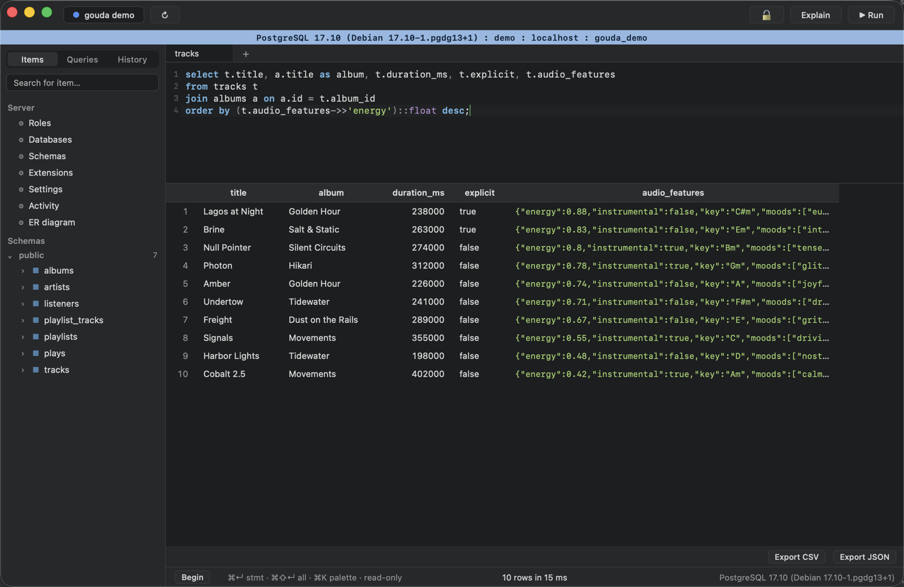
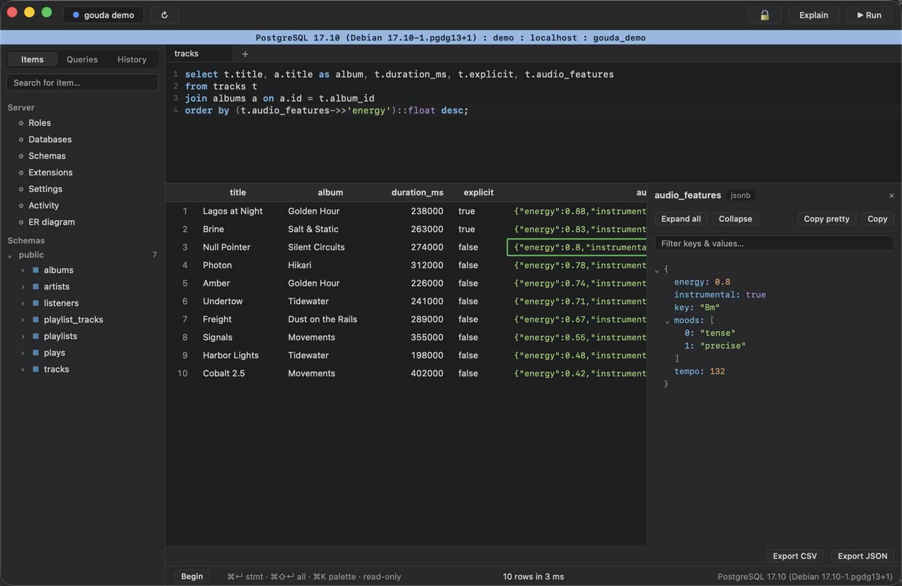
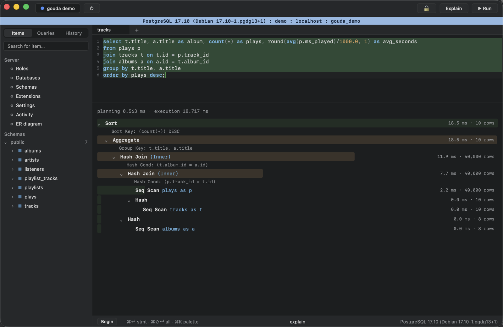
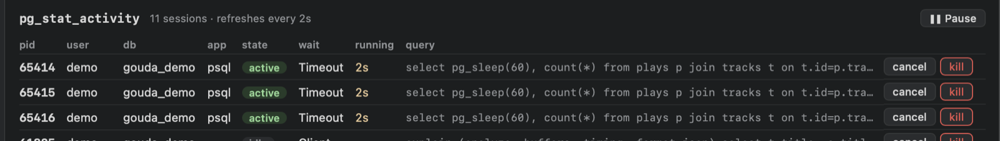
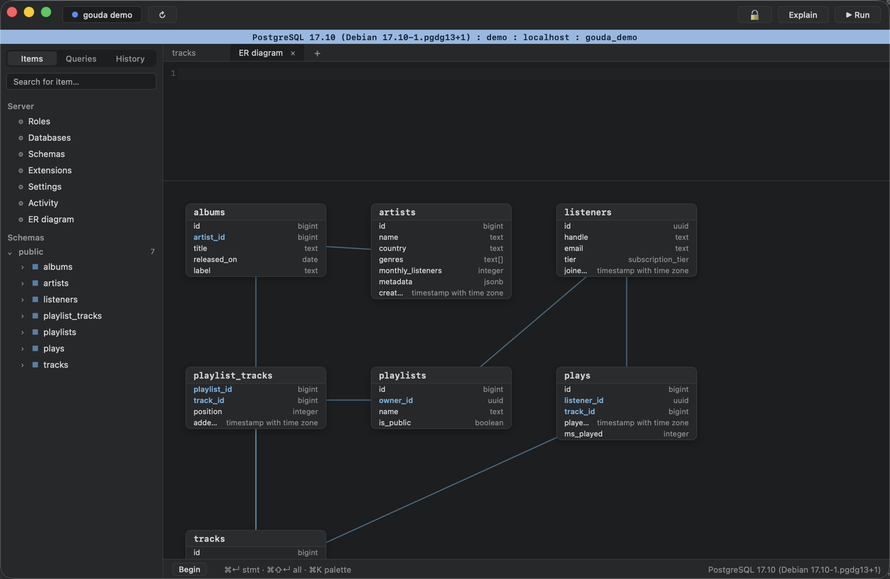
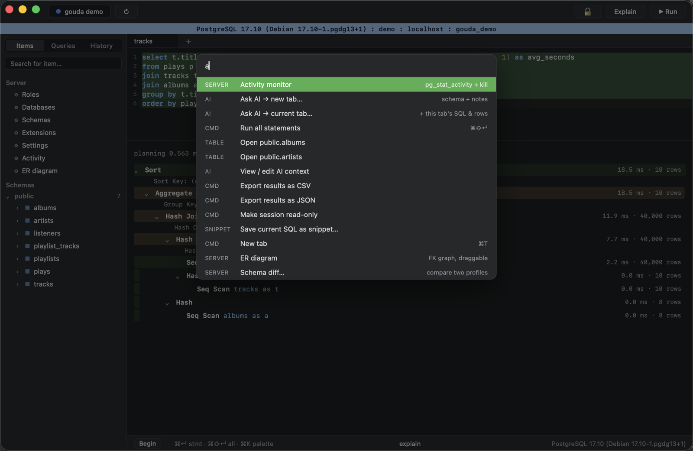

# Gouda

A Postgres workbench for macOS — fast, keyboard-first. Tauri v2 + Rust + React;
~18 MB app, results stream as they arrive.

**→ [kennerminer.github.io/gouda-postgres-workbench](https://kennerminer.github.io/gouda-postgres-workbench/)**



## Features

**Connections**
- Saved profiles with passwords in the **macOS Keychain** (never on disk)
- **SSH tunnels** (pure-Rust russh: agent + key auth, known_hosts verification)
- **TLS** (`disable` / `require` / `verify-full`)
- Per-profile **banner colors** to distinguish prod from dev at a glance
- Per-profile **read-only mode** (`default_transaction_read_only`, server-enforced)
- **Multiple windows** (⌘⇧N), one connection per window
- Auto-reconnect + retry after laptop sleep; connection test button

**Editor**
- CodeMirror 6 with Postgres highlighting and **schema-aware autocomplete**
  (tables after `FROM`, columns after `WHERE`, `alias.` resolution, live from
  the catalog) that triggers eagerly after keywords
- ⌘↵ runs the statement under the cursor · ⌘⇧↵ runs the whole script
- **Tabs** with per-tab results, undo history, and **per-tab sessions** —
  queries run concurrently, transactions are per-tab (statusbar
  Begin / Commit / Rollback with aborted-state tracking)
- **psql backslash commands**: `\du` `\l` `\dn` `\dt` `\dv` `\df` `\dx` `\di`
  `\ds` `\d <table>` `\conninfo` `\?` — translated client-side into catalog
  queries; results land in the grid (sortable, exportable)
- Tabs restore across launches; saved queries with names (sidebar + palette)

**Results grid**
- Virtualized (100k rows without jank), streamed in batches, 50k row cap with
  server-side cancel (full results still exportable — see below)
- Click-to-sort (NULLs last), drag-to-resize columns, keyboard navigation
- Row selection → copy as **CSV / TSV / INSERT**
- **JSONB inspector**: collapsible typed tree, key/value filter,
  copy-as-Postgres-path (`"payload"->'items'->0->>'id'`)



**Editing**
- Results are editable only when they map to a single table with its full
  primary key present (detected from the wire protocol)
- Staged edits → preview the exact SQL → transactional apply; every statement
  must affect exactly one row or the batch rolls back
- Row insert (DEFAULT-aware) and delete; **node-level JSONB edits** staged as
  surgical `jsonb_set` calls that don't clobber sibling keys
- Confirm-before-run for `UPDATE`/`DELETE` without `WHERE`, `TRUNCATE`, `DROP`

**Postgres-native tools**
- **Visual EXPLAIN**: plan tree with time/cost bars, self-time heat,
  est-vs-actual and rows-filtered-out badges (ANALYZE only ever runs for
  selects — writes are planned, never executed)



- **Activity monitor**: live `pg_stat_activity` with cancel / kill per session



- **Schema diff** between two profiles (columns, indexes, constraints)
- **LISTEN/NOTIFY console** with live event log and test sender
- **ER diagram** from the FK graph (draggable; positions persist)



- Structure view (columns / indexes / constraints), sidebar schema browser
  with column lists, server browser (roles, databases, settings…)

**Export** — CSV / JSON streamed server → file with no row cap.

**Ask AI** (optional; uses a local AI CLI you already have — no API key)
- Works with **Claude Code** (`claude`), **Codex** (`codex`), or **opencode**
  (`opencode`) — auto-detected, switchable from the command palette
- ⌘K → *Ask AI*: describe a query, receive it as commented SQL in a tab;
  generated SQL never auto-runs
- *Initialize AI context*: the agent explores the database read-only through
  `psql` and writes an editable `AGENTS.md` describing the data (enum values,
  JSON shapes, conventions), which future requests read automatically

**Command palette** (⌘K) — every command, every table, every saved query.



## Install

Prereqs: [Rust](https://rustup.rs), Node 20+, macOS.

```sh
git clone https://github.com/KennerMiner/gouda-postgres-workbench
cd gouda-postgres-workbench
npm install
npm run tauri build
# → src-tauri/target/release/bundle/macos/Gouda.app — drag to /Applications
```

Dev mode: `npm run tauri dev`.

macOS signing (optional, quiets Keychain prompts across rebuilds): set
`APPLE_SIGNING_IDENTITY` to a codesigning identity for release builds; dev
builds auto-sign with your first available identity via `scripts/dev-run.sh`.

## Keyboard reference

| Keys | Action |
|---|---|
| ⌘↵ | run statement under cursor / selection |
| ⌘⇧↵ | run all statements |
| ⌘E | explain statement under cursor |
| ⌘K | command palette |
| ⌘T / ⌘⇧N | new tab / new window |
| Tab | accept completion |
| ↑↓←→ / ⌘C / Esc | grid navigation / copy / clear |
| Enter / Space | edit cell / inspect cell |
| ⌘⌫ | stage NULL (editing) · mark row deleted (grid) |

## Architecture (short version)

- **Rust backend** (`src-tauri/src/`): `tokio-postgres` with a per-connection
  registry — one base client for metadata plus a lazy session per tab;
  results stream to the UI over Tauri Channels in 500-row batches with types
  mapped to JSON server-side. SSH via `russh`, TLS via `native-tls`, local
  state in SQLite, secrets in the Keychain.
- **React frontend** (`src/`): CodeMirror 6, TanStack Virtual grid, no state
  library — plain hooks.

## Tests

```sh
cd src-tauri && cargo test   # needs a local Postgres; PSQLVIEWER_TEST_DSN to point elsewhere
npx vitest run               # frontend unit tests
```

## Status

See [ROADMAP.md](ROADMAP.md). macOS-only for now: the Keychain integration
and window chrome are macOS-specific; Linux/Windows would need porting work
(PRs welcome).

## License

[MIT](LICENSE)
